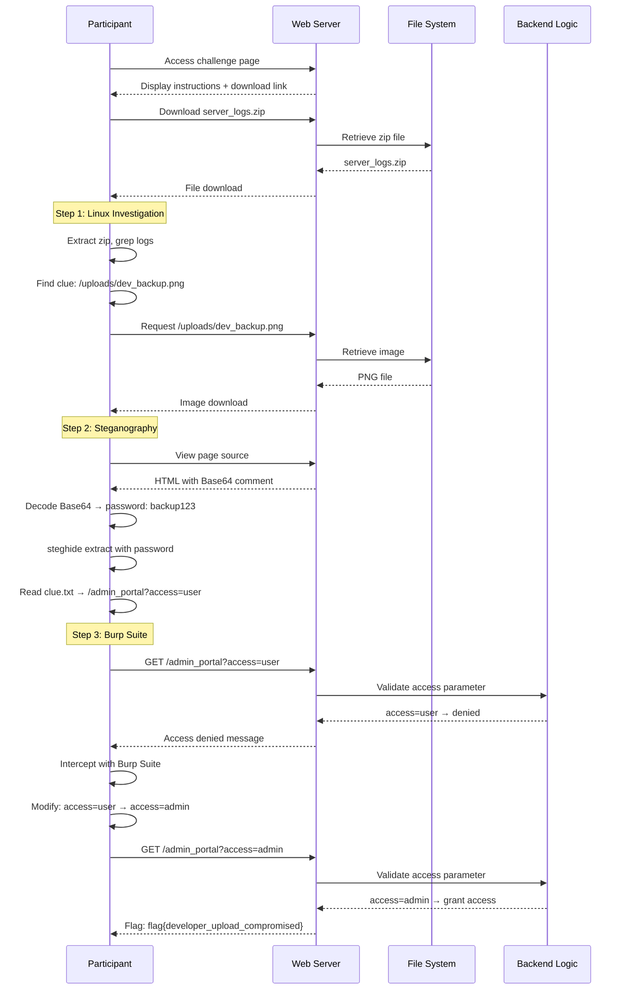

# Design Document: The Suspicious Upload CTF Challenge

## Overview

"The Suspicious Upload" is a web-based Capture The Flag (CTF) challenge designed for university cybersecurity education. The challenge requires participants to use three sequential techniques: Linux command-line investigation, steganography extraction, and HTTP parameter manipulation using Burp Suite. Participants investigate suspicious files uploaded to a university server, discovering hidden clues that lead to an admin portal where the final flag is revealed. The challenge is designed with security-first principles to prevent bypassing intended solution paths while maintaining an easy-to-moderate difficulty level suitable for educational environments.

## Architecture

```mermaid
graph TD
    A[Challenge Landing Page] --> B[Download server_logs.zip]
    B --> C[Linux Investigation<br/>grep/cat commands]
    C --> D[Discover: /uploads/dev_backup.png]
    D --> E[Download Image]
    E --> F[View Page Source<br/>Find Base64 hint]
    F --> G[Decode Base64<br/>Get password: backup123]
    G --> H[Steganography Extraction<br/>steghide with password]
    H --> I[Extract clue.txt<br/>Portal: /admin_portal?access=user]
    I --> J[Access Admin Portal<br/>Initial: Access Denied]
    J --> K[Burp Suite Interception<br/>Modify access=user to access=admin]
    K --> L[Flag Revealed<br/>flag{developer_upload_compromised}]
    
    style A fill:#e1f5ff
    style L fill:#c8e6c9
    style C fill:#fff9c4
    style H fill:#fff9c4
    style K fill:#fff9c4
```

## Sequence Diagrams

### Main Challenge Flow



## Components and Interfaces

### Component 1: Challenge Web Server

**Purpose**: Serves the challenge pages, static files, and handles admin portal authentication logic

**Interface**:
```typescript
interface ChallengeServer {
  serveLandingPage(): Response
  serveLogFiles(): Response
  serveUploadedImage(filename: string): Response
  serveAdminPortal(accessLevel: string): Response
}
```

**Responsibilities**:
- Serve challenge landing page with instructions
- Provide downloadable server_logs.zip
- Serve steganographic image from /uploads
- Validate access parameter and return appropriate response
- Prevent directory listing and unauthorized file access

### Component 2: Admin Portal Handler

**Purpose**: Validates access parameter and returns flag only when correct parameter is provided

**Interface**:
```typescript
interface AdminPortalHandler {
  validateAccess(accessParam: string): AccessResult
  generateResponse(isAuthorized: boolean): Response
}

type AccessResult = {
  authorized: boolean
  message: string
  flag?: string
}
```

**Responsibilities**:
- Parse and validate access query parameter
- Return "Access denied" for access=user
- Return flag for access=admin
- Ensure flag is never exposed in client-side code

### Component 3: File Generator

**Purpose**: Generates realistic log files and prepares steganographic image

**Interface**:
```typescript
interface FileGenerator {
  generateLogFiles(): LogFiles
  embedSteganography(image: Buffer, payload: string, password: string): Buffer
  createZipArchive(files: LogFiles): Buffer
}

type LogFiles = {
  'logs.txt': string
  'access.log': string
  'errors.log': string
}
```

**Responsibilities**:
- Generate realistic log entries (100+ lines per file)
- Insert correct clue and fake clues in logs
- Embed clue.txt into dev_backup.png using steghide
- Create downloadable zip archive

## Data Models

### LogEntry

```typescript
interface LogEntry {
  timestamp: string
  level: 'INFO' | 'DEBUG' | 'WARN' | 'ERROR'
  message: string
  source?: string
}
```

**Validation Rules**:
- timestamp must be valid ISO 8601 format
- level must be one of the specified values
- message must be non-empty string

### ChallengeFile

```typescript
interface ChallengeFile {
  filename: string
  path: string
  content: Buffer | string
  mimeType: string
  isPublic: boolean
}
```

**Validation Rules**:
- filename must not contain path traversal characters (../)
- path must be within allowed directories
- isPublic determines if file can be directly accessed
- mimeType must match file extension

### AdminRequest

```typescript
interface AdminRequest {
  path: string
  queryParams: Record<string, string>
  headers: Record<string, string>
}
```

**Validation Rules**:
- path must be '/admin_portal'
- queryParams must contain 'access' key
- access value must be either 'user' or 'admin'

## Algorithmic Pseudocode

### Main Challenge Workflow Algorithm

```pascal
ALGORITHM processChallengeWorkflow(participantAction)
INPUT: participantAction of type Action
OUTPUT: response of type Response

BEGIN
  ASSERT participantAction.isValid() = true
  
  // Step 1: Linux Investigation Phase
  IF participantAction.type = DOWNLOAD_LOGS THEN
    logFiles ← generateLogFiles()
    zipArchive ← createZipArchive(logFiles)
    RETURN Response(zipArchive, "application/zip")
  END IF
  
  // Step 2: Steganography Phase
  IF participantAction.type = DOWNLOAD_IMAGE THEN
    ASSERT participantAction.filename = "dev_backup.png"
    image ← loadImageWithSteganography()
    RETURN Response(image, "image/png")
  END IF
  
  // Step 3: Burp Suite Phase
  IF participantAction.type = ACCESS_ADMIN_PORTAL THEN
    accessParam ← participantAction.queryParams["access"]
    result ← validateAdminAccess(accessParam)
    RETURN generateAdminResponse(result)
  END IF
  
  RETURN Response("Invalid action", 400)
END
```

**Preconditions**:
- participantAction is well-formed and validated
- All challenge files are properly initialized
- Steganographic image contains embedded clue.txt

**Postconditions**:
- Response is appropriate for the action type
- No sensitive information is leaked in error messages
- Flag is only returned when access=admin

**Loop Invariants**: N/A (no loops in main workflow)

### Log File Generation Algorithm

```pascal
ALGORITHM generateLogFiles()
INPUT: None
OUTPUT: logFiles of type LogFiles

BEGIN
  logFiles ← empty LogFiles structure
  
  // Generate logs.txt with hidden clue
  logEntries ← []
  
  FOR i FROM 1 TO 100 DO
    ASSERT length(logEntries) = i - 1
    
    IF i = 47 THEN
      // Insert correct clue at line 47
      entry ← createLogEntry("DEBUG", "[DEBUG] Backup image stored in /uploads/dev_backup.png")
    ELSE IF i IN [23, 56, 78] THEN
      // Insert fake clues
      fakeClues ← ["/uploads/backup_old.png", "/uploads/test_image.png", "/uploads/dev_test.png"]
      entry ← createLogEntry("DEBUG", "[DEBUG] Old backup: " + fakeClues[random()])
    ELSE
      // Generate realistic log entry
      entry ← generateRealisticLogEntry()
    END IF
    
    logEntries.append(entry)
  END FOR
  
  ASSERT length(logEntries) = 100
  ASSERT contains(logEntries, "dev_backup.png") = true
  
  logFiles['logs.txt'] ← join(logEntries, "\n")
  logFiles['access.log'] ← generateAccessLog(100)
  logFiles['errors.log'] ← generateErrorLog(100)
  
  RETURN logFiles
END
```

**Preconditions**:
- Log generation functions are available
- Random number generator is properly seeded

**Postconditions**:
- Each log file contains at least 100 lines
- logs.txt contains exactly one correct clue
- logs.txt contains multiple fake clues
- All log entries have valid timestamps

**Loop Invariants**:
- logEntries contains exactly i-1 entries at start of iteration i
- All entries in logEntries are valid LogEntry objects

### Admin Access Validation Algorithm

```pascal
ALGORITHM validateAdminAccess(accessParam)
INPUT: accessParam of type string
OUTPUT: result of type AccessResult

BEGIN
  ASSERT accessParam IS NOT NULL
  
  // Normalize input
  normalizedParam ← toLowerCase(trim(accessParam))
  
  // Validate against allowed values
  IF normalizedParam = "admin" THEN
    result ← {
      authorized: true,
      message: "Welcome Admin",
      flag: "flag{developer_upload_compromised}"
    }
  ELSE IF normalizedParam = "user" THEN
    result ← {
      authorized: false,
      message: "Access denied. Admins only.",
      flag: null
    }
  ELSE
    result ← {
      authorized: false,
      message: "Invalid access parameter",
      flag: null
    }
  END IF
  
  ASSERT result.authorized = true IMPLIES result.flag IS NOT NULL
  ASSERT result.authorized = false IMPLIES result.flag IS NULL
  
  RETURN result
END
```

**Preconditions**:
- accessParam is defined (may be empty string)

**Postconditions**:
- Returns AccessResult with valid structure
- Flag is only present when authorized = true
- authorized = true if and only if accessParam = "admin"
- No side effects on input parameter

**Loop Invariants**: N/A (no loops)

### Steganography Embedding Algorithm

```pascal
ALGORITHM embedSteganography(imagePath, payloadPath, password)
INPUT: imagePath (string), payloadPath (string), password (string)
OUTPUT: success (boolean)

BEGIN
  ASSERT fileExists(imagePath) = true
  ASSERT fileExists(payloadPath) = true
  ASSERT length(password) > 0
  
  // Prepare payload
  payloadContent ← readFile(payloadPath)
  ASSERT length(payloadContent) > 0
  
  // Embed using steghide
  command ← "steghide embed -cf " + imagePath + " -ef " + payloadPath + " -p " + password
  exitCode ← executeCommand(command)
  
  IF exitCode = 0 THEN
    // Verify embedding
    testExtract ← attemptExtraction(imagePath, password)
    success ← (testExtract = payloadContent)
  ELSE
    success ← false
  END IF
  
  ASSERT success = true IMPLIES canExtract(imagePath, password) = true
  
  RETURN success
END
```

**Preconditions**:
- imagePath points to valid PNG file
- payloadPath points to valid text file
- password is non-empty string
- steghide tool is installed and accessible

**Postconditions**:
- Returns true if embedding successful
- Embedded data can be extracted with correct password
- Original image remains visually unchanged
- Extraction without password fails

**Loop Invariants**: N/A (no loops)

## Key Functions with Formal Specifications

### Function 1: serveAdminPortal()

```typescript
function serveAdminPortal(request: AdminRequest): Response
```

**Preconditions:**
- request is non-null and well-formed
- request.path === '/admin_portal'
- request.queryParams is defined

**Postconditions:**
- Returns Response object with status code 200
- If access=admin: response.body contains flag
- If access=user: response.body contains "Access denied"
- Flag never appears in response headers or cookies
- No side effects on server state

**Loop Invariants:** N/A

### Function 2: generateLogFiles()

```typescript
function generateLogFiles(): LogFiles
```

**Preconditions:**
- Log templates are available
- Timestamp generator is functional

**Postconditions:**
- Returns LogFiles object with three files
- Each file contains at least 100 lines
- logs.txt contains exactly one occurrence of "dev_backup.png"
- logs.txt contains at least 3 fake clues
- All timestamps are valid and chronologically ordered

**Loop Invariants:**
- For log generation loops: All previously generated entries have valid timestamps

### Function 3: validateAccess()

```typescript
function validateAccess(accessParam: string): AccessResult
```

**Preconditions:**
- accessParam is defined (may be empty)

**Postconditions:**
- Returns AccessResult with valid structure
- result.authorized === true ⟺ accessParam === "admin"
- result.flag is defined ⟺ result.authorized === true
- No exceptions thrown for any input value

**Loop Invariants:** N/A

### Function 4: embedClueInImage()

```typescript
function embedClueInImage(image: Buffer, clue: string, password: string): Buffer
```

**Preconditions:**
- image is valid PNG buffer
- clue is non-empty string
- password is non-empty string

**Postconditions:**
- Returns modified PNG buffer
- Clue can be extracted with correct password
- Clue cannot be extracted without password
- Image dimensions and visual appearance unchanged
- File size may increase slightly

**Loop Invariants:** N/A

## Example Usage

### Participant Workflow Example

```typescript
// Step 1: Linux Investigation
// Participant downloads and extracts server_logs.zip
// Then runs:
// $ grep -r "backup" server_logs/
// Output: [DEBUG] Backup image stored in /uploads/dev_backup.png

// Step 2: Steganography
// Participant views page source and finds:
// <!-- QmFja3VwIHBhc3N3b3JkOiBiYWNrdXAxMjM= -->

// Decode Base64:
// $ echo "QmFja3VwIHBhc3N3b3JkOiBiYWNrdXAxMjM=" | base64 -d
// Output: Backup password: backup123

// Extract hidden file:
// $ steghide extract -sf dev_backup.png
// Enter passphrase: backup123
// wrote extracted data to "clue.txt"

// $ cat clue.txt
// Admin portal: /admin_portal
// Parameter hint: access=user

// Step 3: Burp Suite
// Participant accesses: http://challenge.ctf/admin_portal?access=user
// Response: "Access denied. Admins only."

// Using Burp Suite, intercept and modify:
// Original: GET /admin_portal?access=user
// Modified: GET /admin_portal?access=admin

// Final Response:
// Welcome Admin
// flag{developer_upload_compromised}
```

### Server Implementation Example

```typescript
// Express.js route handler
app.get('/admin_portal', (req, res) => {
  const accessParam = req.query.access as string
  
  if (!accessParam) {
    return res.status(400).send('Missing access parameter')
  }
  
  const result = validateAccess(accessParam)
  
  if (result.authorized) {
    res.send(`Welcome Admin\n${result.flag}`)
  } else {
    res.send(result.message)
  }
})

// File download handler
app.get('/downloads/server_logs.zip', (req, res) => {
  const zipPath = path.join(__dirname, 'challenge_files', 'server_logs.zip')
  res.download(zipPath)
})

// Image handler
app.get('/uploads/:filename', (req, res) => {
  const filename = req.params.filename
  
  // Only allow specific file
  if (filename !== 'dev_backup.png') {
    return res.status(404).send('File not found')
  }
  
  const imagePath = path.join(__dirname, 'uploads', filename)
  res.sendFile(imagePath)
})
```

## Correctness Properties

### Property 1: Flag Isolation
**∀ request ∈ Requests**: (request.queryParams.access ≠ "admin") ⟹ (response.body ∌ "flag{")

The flag shall never appear in any response unless the access parameter is exactly "admin".

### Property 2: Steganography Integrity
**∀ image ∈ ChallengeImages**: (extractWithPassword(image, "backup123") = "clue.txt") ∧ (extractWithoutPassword(image) = ∅)

The steganographic image must yield clue.txt when extracted with the correct password and fail without it.

### Property 3: Log Clue Uniqueness
**∀ logFile ∈ LogFiles**: (count(logFile, "dev_backup.png") = 1) ∧ (count(logFile, "fake_clue") ≥ 3)

The correct clue must appear exactly once while fake clues appear multiple times to require careful investigation.

### Property 4: Sequential Dependency
**∀ participant ∈ Participants**: (hasFlag(participant) = true) ⟹ (completedLinux(participant) ∧ completedStego(participant) ∧ completedBurp(participant))

A participant can only obtain the flag by completing all three steps in sequence.

### Property 5: Parameter Validation
**∀ accessParam ∈ Strings**: (validateAccess(accessParam).authorized = true) ⟺ (toLowerCase(trim(accessParam)) = "admin")

Access is granted if and only if the parameter value is exactly "admin" (case-insensitive, trimmed).

### Property 6: No Client-Side Flag Exposure
**∀ page ∈ WebPages**: (page.source ∌ "flag{") ∧ (page.javascript ∌ "flag{") ∧ (page.comments ∌ "flag{")

The flag must never appear in HTML source, JavaScript code, or HTML comments.

### Property 7: File Access Control
**∀ file ∈ ServerFiles**: (file.path ∉ AllowedPaths) ⟹ (accessAttempt(file) = 403)

Only explicitly allowed files can be accessed; all other file access attempts must be denied.

### Property 8: Fake File Non-Existence
**∀ fakeFile ∈ FakeClues**: (fileExists(fakeFile) = false)

Files referenced in fake clues must not exist on the server to prevent alternative solution paths.

## Error Handling

### Error Scenario 1: Invalid Access Parameter

**Condition**: User provides access parameter with value other than "user" or "admin"
**Response**: HTTP 200 with message "Invalid access parameter"
**Recovery**: User must correct the parameter value

### Error Scenario 2: Missing Access Parameter

**Condition**: User accesses /admin_portal without access query parameter
**Response**: HTTP 400 with message "Missing access parameter"
**Recovery**: User must add access parameter to URL

### Error Scenario 3: Unauthorized File Access

**Condition**: User attempts to access file not in allowed list (e.g., /uploads/clue.txt)
**Response**: HTTP 404 with message "File not found"
**Recovery**: User must find correct file path through intended challenge steps

### Error Scenario 4: Directory Listing Attempt

**Condition**: User attempts to access /uploads/ directory
**Response**: HTTP 403 with message "Forbidden"
**Recovery**: User must discover specific filenames through challenge clues

### Error Scenario 5: Incorrect Steghide Password

**Condition**: User attempts to extract with wrong password
**Response**: steghide error: "could not extract any data with that passphrase!"
**Recovery**: User must find correct password in page source

### Error Scenario 6: Path Traversal Attempt

**Condition**: User attempts to access files using ../ in path
**Response**: HTTP 400 with message "Invalid file path"
**Recovery**: Request is rejected; user must use valid paths

## Testing Strategy

### Unit Testing Approach

Test each component in isolation:

1. **Admin Portal Validation**
   - Test validateAccess() with "admin", "user", empty string, null, special characters
   - Verify flag only returned for "admin"
   - Verify case-insensitivity and trimming

2. **Log File Generation**
   - Verify each log file has 100+ lines
   - Verify correct clue appears exactly once
   - Verify fake clues appear multiple times
   - Verify timestamps are valid and ordered

3. **File Access Control**
   - Test allowed file access returns 200
   - Test disallowed file access returns 404
   - Test directory listing returns 403
   - Test path traversal attempts are blocked

4. **Steganography**
   - Verify clue.txt can be extracted with correct password
   - Verify extraction fails with wrong password
   - Verify image visual integrity maintained

### Property-Based Testing Approach

**Property Test Library**: fast-check (for TypeScript/Node.js)

**Property Test 1: Access Parameter Validation**
```typescript
fc.assert(
  fc.property(fc.string(), (accessParam) => {
    const result = validateAccess(accessParam)
    const isAdmin = accessParam.trim().toLowerCase() === 'admin'
    return result.authorized === isAdmin && 
           (result.authorized ? result.flag !== undefined : result.flag === undefined)
  })
)
```

**Property Test 2: Flag Never in Unauthorized Response**
```typescript
fc.assert(
  fc.property(fc.string().filter(s => s.toLowerCase() !== 'admin'), (accessParam) => {
    const response = serveAdminPortal({ queryParams: { access: accessParam } })
    return !response.body.includes('flag{')
  })
)
```

**Property Test 3: File Path Validation**
```typescript
fc.assert(
  fc.property(fc.string(), (filename) => {
    const isAllowed = filename === 'dev_backup.png'
    const response = serveUploadedImage(filename)
    return isAllowed ? response.status === 200 : response.status === 404
  })
)
```

### Integration Testing Approach

Test complete challenge workflow:

1. **End-to-End Challenge Completion**
   - Simulate participant downloading logs
   - Parse logs to find correct clue
   - Download image
   - Extract steganography with password
   - Access admin portal with modified parameter
   - Verify flag is returned

2. **Security Bypass Attempts**
   - Attempt to access flag without completing steps
   - Attempt directory listing
   - Attempt path traversal
   - Attempt SQL injection in parameters
   - Verify all bypass attempts fail

3. **Multi-User Concurrency**
   - Simulate multiple participants accessing challenge simultaneously
   - Verify no state leakage between users
   - Verify consistent responses

## Performance Considerations

1. **Static File Caching**: Cache server_logs.zip and dev_backup.png in memory to reduce disk I/O
2. **Log Generation**: Pre-generate log files during server startup rather than on-demand
3. **Rate Limiting**: Implement rate limiting on admin portal to prevent brute-force attempts
4. **Response Size**: Keep log files under 1MB total to ensure fast downloads
5. **Concurrent Users**: Design for 50-100 concurrent participants typical of university CTF

## Security Considerations

### Threat Model

**Attacker Goal**: Obtain flag without completing intended challenge steps

**Attack Vectors**:
1. Direct flag discovery through source code inspection
2. Bypassing steganography by accessing clue.txt directly
3. Brute-forcing admin portal parameters
4. Path traversal to access unauthorized files
5. Directory listing to discover file structure

### Security Controls

1. **Server-Side Flag Generation**: Flag only generated server-side when access=admin validated
2. **File Access Whitelist**: Only dev_backup.png accessible in /uploads directory
3. **No Client-Side Secrets**: No flags, passwords, or clues in JavaScript or HTML (except Base64 hint)
4. **Directory Listing Disabled**: Prevent enumeration of /uploads directory
5. **Path Traversal Protection**: Validate and sanitize all file path inputs
6. **Fake File Non-Existence**: Fake clues reference non-existent files
7. **Parameter Validation**: Strict validation of access parameter values
8. **Rate Limiting**: Prevent brute-force parameter guessing
9. **Logging**: Log all admin portal access attempts for monitoring
10. **Isolated Environment**: Deploy in containerized environment to prevent server compromise

### Secure Deployment Checklist

- [ ] Flag stored only in server-side code, never in static files
- [ ] Directory listing disabled for all directories
- [ ] File access restricted to whitelist
- [ ] Path traversal protection implemented
- [ ] Rate limiting configured
- [ ] Error messages don't leak sensitive information
- [ ] Steganographic image contains no metadata revealing password
- [ ] Base64 hint is only clue to password (no other leaks)
- [ ] Admin portal validates parameter server-side
- [ ] No debug endpoints or admin backdoors enabled

## Dependencies

### Runtime Dependencies

1. **Node.js** (v18+): JavaScript runtime for server
2. **Express.js** (v4.18+): Web framework for routing and middleware
3. **steghide** (v0.5.1+): Command-line tool for steganography
4. **archiver** (v5.3+): Library for creating zip archives
5. **body-parser** (v1.20+): Parse incoming request bodies
6. **express-rate-limit** (v6.7+): Rate limiting middleware

### Development Dependencies

1. **TypeScript** (v5.0+): Type-safe development
2. **@types/node**: TypeScript definitions for Node.js
3. **@types/express**: TypeScript definitions for Express
4. **jest** (v29+): Testing framework
5. **fast-check** (v3.8+): Property-based testing library
6. **supertest** (v6.3+): HTTP assertion library for integration tests

### System Dependencies

1. **steghide**: Must be installed on server for steganography embedding
2. **ImageMagick** (optional): For image validation and processing
3. **Linux/Unix environment**: For realistic log file generation

### External Services

None required - challenge runs entirely on local server for security and isolation.
